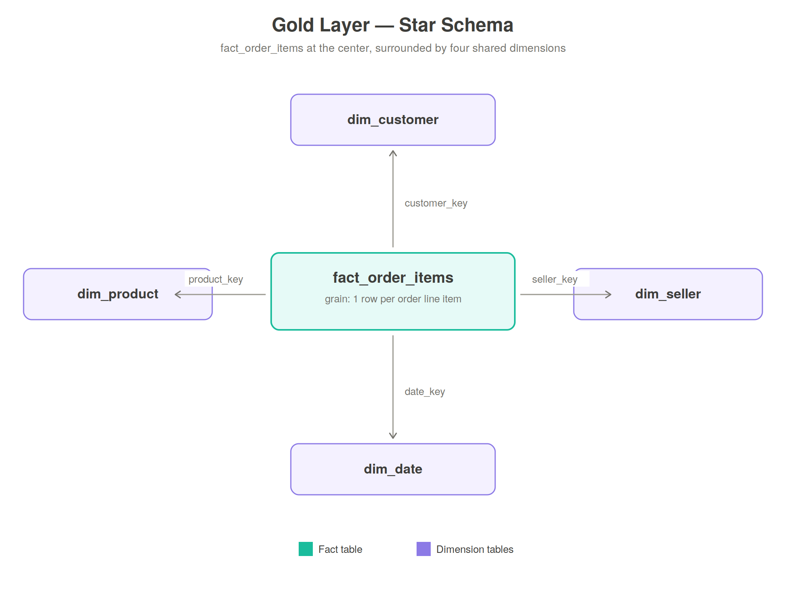
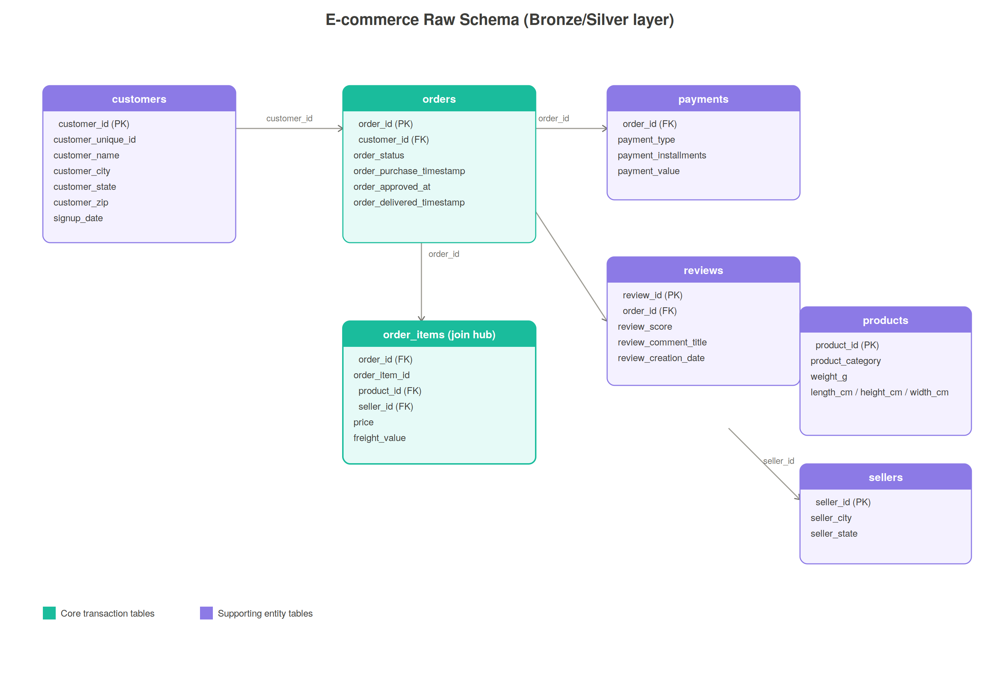

# E-commerce Medallion Architecture — Databricks + Spark

A learning/portfolio project implementing the **Medallion Architecture**
(Bronze → Silver → Gold) on Databricks, using PySpark and Delta Lake, on a
synthetic e-commerce dataset modeled after the Olist Brazilian E-commerce
dataset.

## Architecture

**Bronze** — raw CSVs landed as-is into Delta tables, no transformation,
just an added ingestion timestamp.

**Silver** — cleaned and conformed: trimmed strings, deduped rows, fixed
inconsistent date formats, orphan foreign keys identified and handled.

**Gold** — a star schema (fact constellation) optimized for BI queries:
4 shared dimensions and 3 fact tables.



The raw/Silver schema this is all built from:



## Repo structure

```
notebooks/
  00_schema_creation.ipynb    — creates the ecommerce.bronze / .silver / .gold schemas
  silver/
    silver_customers.ipynb    — trims/lowercases name + city, leaves nulls as-is
    silver_orders.ipynb       — fixes timestamp type + inconsistent date formats,
                                 renames order_approved_at -> order_approved_timestamp
    silver_order_items.ipynb  — passthrough, no issues found
    silver_payments.ipynb     — passthrough, no issues found
    silver_products.ipynb     — passthrough, weight_g nulls left as-is
    silver_sellers.ipynb      — trims/lowercases seller_city
  gold/
    build_gold_star_schema.ipynb — builds dim_date, dim_customer, dim_product,
                                     dim_seller, fact_order_items, fact_payments,
                                     fact_reviews from the Silver layer
dashboard/
  ecommerce_dashboard.pbix    — Power BI report built on top of the Gold layer
docs/
  erd_diagram.png / .svg      — raw schema entity relationship diagram
  star_schema_diagram.png / .svg — Gold layer star schema diagram
data/
  *.csv                       — synthetic source data (intentionally messy,
                                  see below)
```

## Known issues / open items

- **`silver.reviews` has no matching notebook yet.** `build_gold_star_schema.ipynb`
  reads from `ecommerce.silver.reviews` to build `fact_reviews`, but no
  `silver_reviews.ipynb` was built. Add one (even a passthrough, like
  `silver_order_items.ipynb`) before running the Gold notebook end-to-end.
- **`dim_seller` is sourced from `ecommerce.silver.seller`** (singular), while
  every other Silver table is plural (`customers`, `orders`, `order_items`,
  `payments`, `products`). It works because the Gold notebook's read matches
  the singular name, but it's an inconsistency worth cleaning up — either
  rename the table to `sellers` or document why it's the exception.
- **The duplicate-order fix in `build_gold_star_schema.ipynb`'s last cell is
  disabled.** It's prefixed with `%skip`, which isn't a real Databricks magic
  command — the cell won't run as-is. The fix itself is correct (it dedupes
  `silver_orders` on `order_id` before joining, which matters because the
  source data has ~15 intentional duplicate order rows that would otherwise
  fan out `fact_order_items`/`fact_payments`/`fact_reviews`). Remove `%skip`
  and merge this logic into the main build rather than leaving it as a
  disabled trailing cell.

## The dataset

Seven tables — `customers`, `sellers`, `products`, `orders`, `order_items`,
`payments`, `reviews` — generated synthetically to mirror a real marketplace
dataset's shape and its data-quality problems:

- Mixed casing / stray whitespace in text fields
- Nulls in optional fields (delivery timestamps, review comments)
- A handful of exact duplicate rows in `orders`
- Inconsistent date formats on a few rows
- Orphan foreign keys — some `order_items` rows reference a `product_id`/
  `seller_id` that doesn't exist
- A few negative price values
- Duplicate customer sign-ups

This is deliberate: cleaning this mess is what the Silver layer is for.

## Gold layer design

Grain: **`fact_order_items`** is one row per order line item — the finest
grain available in the source data. `fact_payments` and `fact_reviews`
share the same `dim_customer`/`dim_date` dimensions but sit at the order
grain, forming a fact constellation rather than a single star.

Every dimension includes a `-1` "unknown member" row, so a fact row whose
foreign key doesn't resolve (see: orphan `product_id`/`seller_id` above)
is routed there instead of silently dropped by an inner join.

## Dashboard

Built in Power BI on top of the Gold star schema:
- KPI cards: total revenue, total orders, average order value
- Revenue by month (line chart)
- Revenue by customer state (bar chart)
- Top 10 product categories by revenue (bar chart)
- Top 10 sellers by revenue (bar chart)
- Review score distribution (column chart)

## Tech stack

- Databricks (Free Edition) with Unity Catalog
- PySpark / Delta Lake
- Power BI Desktop (Databricks connector, Import mode)
# ecommerce_medallion_pipeline
